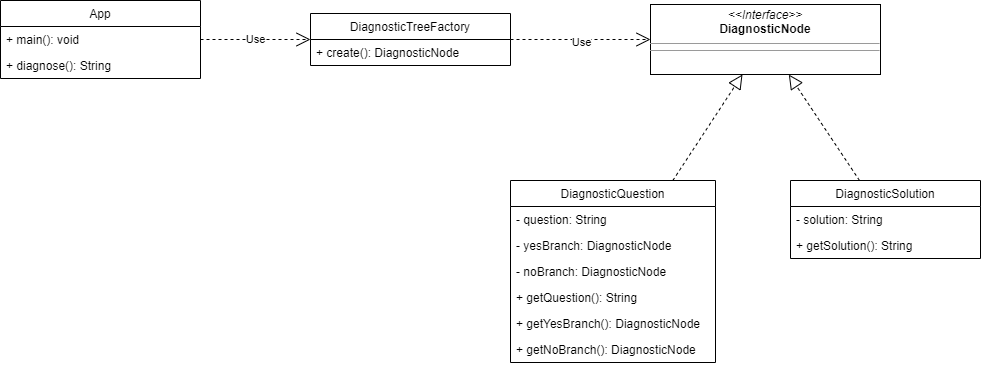

# Troubleshooting Car Issues

Decision-tree-based car issue troubleshoot algorithm implemented in Java.

## Class Diagram

Here is a UML class diagram that represents the structure of the application.



## Building the Application

This is a Maven project, and to build it, you can use the following command:

```
mvn clean install
```

This will build the project and run all unit tests.
